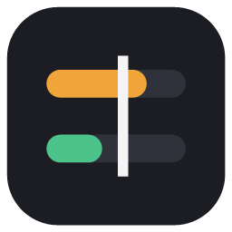
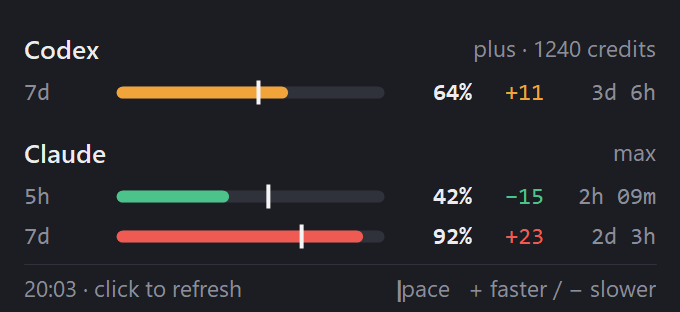
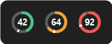

<p align="center">
  
</p>

<h1 align="center">UsageTray</h1>

<p align="center">
  <b>Your Codex and Claude subscription limits at a glance — and whether you're on pace to make it to the reset.</b>
</p>

<p align="center">
  <a href="https://github.com/MosrednA/UsageTray/releases/latest"></a>
  <a href="https://github.com/MosrednA/UsageTray/actions/workflows/ci.yml"></a>
  
  <a href="LICENSE"></a>
</p>

<p align="center">
  
</p>

A tiny native Windows tray app. One glance at the icon tells you if you're burning through a limit; one click shows every window with a pace marker, so you know whether to slow down — or that you've got room to spare.

- **Pace, not just percentage.** A white tick marks where you'd be with perfectly even usage. Past the tick means you're going too fast.
- **Codex + Claude in one place.** Weekly and 5-hour windows, model-specific limits, Codex credits and free resets.
- **No extra logins.** Uses the sign-ins of the official Codex and Claude Code CLIs. No API keys.
- **Lightweight.** Native WinForms, no dependencies, no telemetry. Refreshes every 2 minutes.

## Install

**Requires** Windows 10 or 11, plus the [Codex CLI](https://github.com/openai/codex) and/or [Claude Code](https://code.claude.com/docs/en/overview) signed in with a subscription. UsageTray shows whichever of the two it finds.

Download **[UsageTray-win-x64.exe](https://github.com/MosrednA/UsageTray/releases/latest/download/UsageTray-win-x64.exe)** and run it. Nothing to install.

> **"Windows protected your PC"?** The exe isn't code-signed, so SmartScreen warns on first run. Click *More info → Run anyway*, or [build it yourself](#build-from-source).
>
> Prefer a ~250 KB download instead of ~50 MB? Grab `UsageTray-win-x64-small.exe` from the [release](https://github.com/MosrednA/UsageTray/releases/latest) instead — it needs the [.NET 10 Desktop Runtime](https://dotnet.microsoft.com/download/dotnet/10.0).

Then:

1. **Keep the icon visible** — drag it from the `^` overflow onto the taskbar (or *Taskbar settings → Other system tray icons → UsageTray*).
2. **Start with Windows** — right-click the icon and tick it.
3. **Signed out?** Click the red message in the flyout (or right-click → *Sign in to Codex…* / *Sign in to Claude…*). This runs the official `codex login` or `claude auth login`.

## Reading it

```
7d   ███│███│███│██▏│░░░│░░░│░░░   64%   +11   3d 6h
│    │             │               │     │     └─ time until reset
│    │             │               │     └────── points ahead of (+) or behind (−) even pace
│    │             │               └──────────── used
│    │             └──────────────────────────── pace: where even usage would put you now
│    └────────────────────────────────────────── usage, split per day (7d) or per hour (5h)
└─────────────────────────────────────────────── window: 5h, 7d, opus, sonnet
```

| | |
|---|---|
| 🟢 **Green** | On or under pace |
| 🟠 **Orange** | Faster than pace |
| 🔴 **Red** | ≥ 90 % used, or > 15 points ahead of pace |

### Tray icon

Pick a style via right-click → **Icon**. All three follow the same colors and adapt to light and dark taskbars.

| Style | | Shows |
|---|---|---|
| **Ring** (default) |  | The window most at risk: % inside, progress ring, pace notch |
| **Bars** |  | Codex (left) and Claude (right) side by side, each with a pace tick |
| **Classic** |  | The window most at risk as a colored tile |

Hover the icon for a one-line summary of everything.

> **Tip:** a 5-hour window only starts when you send your first message, so early on you'll almost always be "ahead of pace". For 5h, watch the percentage; for 7d, the pace is what matters.

| Action | |
|---|---|
| Click the icon | Open / close the flyout |
| Right-click | Refresh · Sign in to Codex / Claude · Icon style · Start with Windows · Quit |
| `F5` / `R`, or click the footer | Refresh now |
| `Esc`, or click elsewhere | Close |

The UI is in English, or Dutch when Windows is set to Dutch. Force a language with `USAGETRAY_LANG=en` or `nl`.

## Where the numbers come from

| | Source | Notes |
|---|---|---|
| **Codex** | The official `codex app-server` (`account/rateLimits/read`), run locally | Live, using Codex's own login. Also shows credits and available free resets. If the CLI isn't on your `PATH`, it falls back to the last snapshot in `~/.codex/sessions` (labeled *as of 14:50*). |
| **Claude** | `api.anthropic.com/api/oauth/usage`, using the Claude Code CLI login in `~/.claude/.credentials.json` | Same data as `/usage` in Claude Code. Expired access tokens are refreshed and written back atomically, so the CLI keeps working. |

A provider that isn't installed is simply hidden.

### Privacy & security

- **Runs** `codex app-server` locally for a second on each refresh; Codex handles its own auth and network.
- **Reads** the Claude Code credentials file, and your Codex session logs as a fallback.
- **Writes** only refreshed Claude tokens back to that same credentials file, plus the optional autostart entry (`HKCU\…\Run`).
- **Talks to** `platform.claude.com` (token refresh) and `api.anthropic.com` (usage) itself. Nothing else. No telemetry, no analytics.

## Build from source

Requires the [.NET 10 SDK](https://dotnet.microsoft.com/download).

```bash
git clone https://github.com/MosrednA/UsageTray.git
cd UsageTray
dotnet run -c Release
```

| | |
|---|---|
| `UsageTray --snapshot out.png` | Render the flyout with your live data to a PNG |
| `UsageTray --render-assets` | Regenerate `docs/*.png` and `assets/app.ico` from demo data |
| `UsageTray --preview-icons out.png` | All icon styles at 16–32 px on dark and light taskbars, magnified |

Tag a commit `v*` to build and publish a release automatically.

<details>
<summary>Project layout</summary>

| File | Role |
|---|---|
| `TrayApp.cs` | Tray icon, menu, refresh timer, sign-in, autostart |
| `PopupForm.cs` | The flyout — custom-drawn, DPI-aware |
| `CodexSource.cs` | Codex via `codex app-server`, with session-log fallback |
| `ClaudeSource.cs` | OAuth token refresh + usage endpoint |
| `Models.cs` | Usage windows, pace math, formatting |
| `IconRenderer.cs` | Tray icon styles and logo |
| `DocAssets.cs` | README images and `.ico` generator |
| `L.cs` | English / Dutch strings |

</details>

## Caveats

- The Claude usage endpoint is **undocumented** and may change without notice. If Claude stops showing up after an update, that's the likely cause.
- `codex app-server` is marked *experimental* by the Codex CLI. If it changes, UsageTray falls back to the session logs until it's updated.
- UsageTray reuses the Claude Code CLI login rather than logging in itself. The Claude desktop app keeps its own login, which UsageTray can't access.
- UsageTray is an independent project and is **not affiliated with or endorsed by OpenAI or Anthropic**. Codex and Claude are trademarks of their respective owners.

## License

[MIT](LICENSE)
